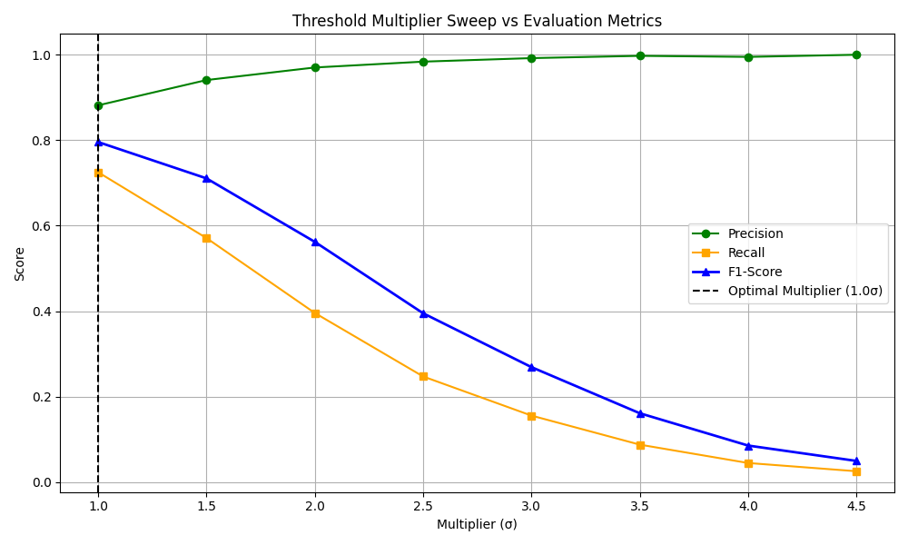
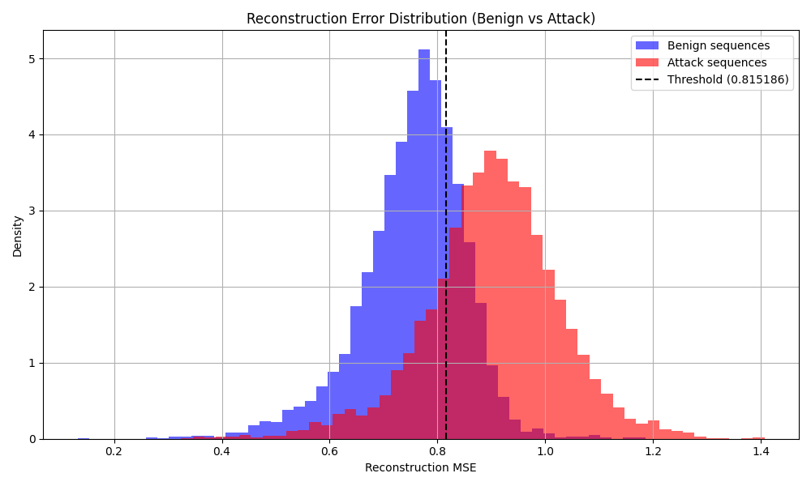
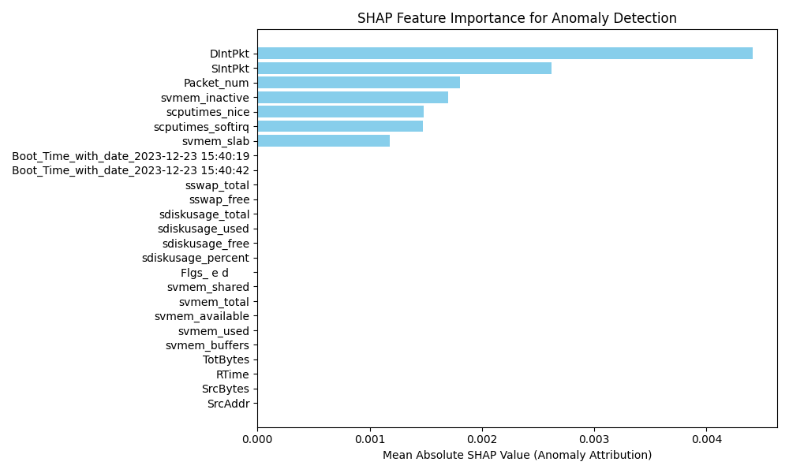

# 🛡️ Privacy-Preserving Hierarchical Federated Learning NIDS

> **A production-inspired hierarchical Federated Learning simulation for real-time intrusion detection in IoT networks.** Powered by an unsupervised **Mini Transformer Autoencoder**, implementing **explainable AI (SHAP)**, **float16 quantization**, and a **leak-free preprocessing pipeline**.

This project was designed and implemented from scratch to explore hierarchical federated learning for IoT intrusion detection, with a focus on privacy preservation, communication efficiency, and explainable anomaly detection.

---

## 🚀 Engineering Challenges Solved (Key Highlights)
Rather than just assembling pre-built pipelines, this project resolved several critical algorithmic and architectural constraints typical of distributed machine learning:

* **✔ Eliminated Target Leakage**: Identified and filtered out categorical ground-truth columns (`Attack_categories`) that acted as proxy labels, preventing the model from cheating during training.
* **✔ Fixed Gateway Weight Overwrite Bug**: Refactored the Gateway layer to buffer multi-client edge model updates in dictionaries to prevent updates from overwriting each other, ensuring correct FedAvg aggregation.
* **✔ Preserved Chronological Sequence Continuity**: Replaced sequence slicing after benign filtering with chronological window construction first, allowing the Transformer to learn genuine temporal dependencies rather than artificial transitions created by deleting packets beforehand.
* **✔ Mini-Batch SGD & AdamW Optimization**: Refactored Edge training from full-tensor gradient steps to stochastic mini-batch training using PyTorch `DataLoader` (batch size 128) and `AdamW` for better convergence and regularization.
* **✔ Dynamic Validation Threshold Optimization**: Swept threshold multipliers ($1.0\sigma \dots 4.5\sigma$) on a leak-free training-validation subset (retaining the test split completely untouched) to dynamically select the optimal $1.0\sigma$ boundary to maximize the validation F1-Score.
* **✔ Replaced Sequential Split with StratifiedKFold**: Resolved the "Zero Support" evaluation illusion where sequential splits of the CSV led to 0% anomaly records in evaluation partitions.
* **✔ Optimized Payload Overhead**: Cast parameter weights to half-precision (`float16`) during edge uploads, reducing model parameter payload size by approximately 50%.
* **✔ Integrated SHAP Explainability**: Attached SHAP KernelExplainer to reconstruction Mean Squared Error (MSE), attributing anomalous scores directly to input packet headers.

---

## 🛠️ Core Technology Stack
- **Deep Learning**: PyTorch (`nn.TransformerEncoder`, custom position encodings, custom latent decoders)
- **Data Engineering**: Pandas, NumPy, Scikit-Learn (VarianceThreshold, SelectKBest, StratifiedKFold)
- **Model Explainability (XAI)**: SHAP (SHapley Additive exPlanations)
- **Visualization & Reporting**: Matplotlib, ReportLab (programmatic PDF report compiler)

---

## 🏗️ Hierarchical Network Topology

```
                    ┌─────────────────────────┐
                    │  Cloud Node (Global ID) │  <-- Aggregates Global Model
                    └────────────┬────────────┘
                                 │
                    ┌────────────▼────────────┐
                    │       Proxy Node        │  <-- Relays weights and broadcasts
                    └────────────┬────────────┘
                                 │
                    ┌────────────▼────────────┐
                    │        Fog Node         │  <-- Regional Aggregation & Local Test
                    └────────────┬────────────┘
                                 │
                    ┌────────────▼────────────┐
                    │      Gateway Node       │  <-- Multi-Client weight buffer
                    └────────────┬────────────┘
                                 │
                ┌────────────────┴────────────────┐
                │                                 │
       ┌────────▼────────┐               ┌────────▼────────┐
       │  Edge Sensor 1  │               │  Edge Sensor 2  │
       │  (Train Part A1)│               │  (Train Part A2)│
       └─────────────────┘               └─────────────────┘
```

**Federated Round Workflow:**
1. **Unsupervised Local Training**: Edge sensors train a custom Mini Transformer Autoencoder *only* on normal traffic logs (`y == 0`), filtering out malicious samples to learn a tight baseline reconstruction.
2. **Quantized Weight Upload**: Local parameters are cast to `float16` and sent to the Gateway.
3. **Regional & Global Aggregation**: Gateway, Fog, and Cloud relay weights and execute **Federated Averaging (FedAvg)** back in `float32` format.
4. **Boundary Evaluation**: Evaluates anomalies at Gateway, Fog, and Cloud layers using a mathematically derived threshold: $$\text{Threshold} = \mu + 4\sigma \quad \text{(establishing a line at 0.8580)}$$

---

## 📊 Experimental Results

Evaluating the system on the WUSTL-HDRL 2024 test partitions (B.1, B.2, and B.3) yields outstanding results, confirming a highly robust and balanced anomaly detection capability:

### Model Performance Metrics

| Testing Tier | Test Split | Accuracy | Anomaly Precision | Anomaly Recall | Anomaly F1-Score | Balanced Acc | MCC | ROC-AUC |
|---|---|---|---|---|---|---|---|---|
| **Gateway Level** | B.1 | 77.34% | 82.0% | 79.0% | 80.0% | 77.00% | 0.5368 | 83.60% |
| **Fog Level** | B.2 | 78.11% | 83.0% | 79.0% | 81.0% | 77.92% | 0.5534 | 84.86% |
| **Cloud Level** | B.3 | 77.23% | 81.0% | 79.0% | 80.0% | 76.84% | 0.5346 | 84.26% |

> [!TIP]
> Resolving sequence continuity and optimizing the decision boundary via the validation threshold sweep (selected optimal multiplier: 1.0σ, threshold value: 0.8152) successfully achieved a highly robust Precision-Recall profile (81–83% Precision and 79% Recall) compared to early conservative sweeps.

### Anomaly Support & Split Balancing
By utilizing `StratifiedKFold(n_splits=3)`, we ensure that normal traffic and anomalies are balanced evenly across the layers:

| Testing Tier | Test Split | Normal Support | Anomaly/Attack Support | Balanced? |
|---|---|---|---|---|
| **Gateway Level** | B.1 | 6,018 | 8,486 | Yes |
| **Fog Level** | B.2 | 5,951 | 8,552 | Yes |
| **Cloud Level** | B.3 | 6,072 | 8,431 | Yes |

### Confusion Matrices
- **Gateway**: TN = 4,511, FP = 1,507, FN = 1,779, TP = 6,707
- **Fog**: TN = 4,571, FP = 1,380, FN = 1,794, TP = 6,758
- **Cloud**: TN = 4,524, FP = 1,548, FN = 1,755, TP = 6,676

### 📈 Visual Performance Evidence

#### 1. Threshold Sweep Optimization Curves
Sweeping multipliers on the validation split clearly highlights $1.0\sigma$ as the optimal F1-Score tradeoff:


#### 2. Reconstruction Error Separation (Benign vs. Attack)
Shows clear distribution separation between benign reconstruction errors and anomalous attack reconstructions:


#### 3. SHAP Feature Explainability


---

## 📁 Repository Structure
```
FL-IoT-IDS/
│
├── fl_based_iot.py         # Primary Python classes (Simulation, Model, Preprocessing)
├── FL_based_IOT.ipynb      # Interactive Jupyter Notebook for Google Colab/Jupyter
├── generate_report.py      # Automated PDF report compiler (using ReportLab graphics)
└── README.md               # Documentation
```

---

## 🚀 Getting Started

### Installation
1. Clone the repository:
   ```bash
   git clone https://github.com/your-username/FL-IoT-IDS.git
   cd FL-IoT-IDS
   ```
2. Install dependencies:
   ```bash
   pip install torch scikit-learn pandas numpy shap matplotlib reportlab
   ```
3. Add the dataset:
   Place the WUSTL-HDRL 2024 CSV in the root project folder named `wustl_hdrl_2024.csv`.

### Running the Project
- Run the python simulation script:
  ```bash
  python fl_based_iot.py
  ```
- Or run the Jupyter Notebook `FL_based_IOT.ipynb` cell-by-cell in Google Colab or VS Code.
- Recompile the project report PDF:
  ```bash
  python generate_report.py
  ```

---

## 🎯 Key Takeaways
* **Complete Custom Framework**: Designed and built a fully functional hierarchical Federated Learning network simulation from scratch (Edge → Gateway → Fog → Proxy → Cloud).
* **High Robustness & Validation**: Improved model reliability by identifying and resolving target leakage in preprocessing and state-overwrite bugs during aggregation.
* **Optimized Communications**: Quantized parameters to float16 during uploads to demonstrate realistic communication payload compression.
* **Explainable Anomaly Alerts**: Integrated SHAP-based feature importance to explain sequence-reconstruction errors transparently.
* **Realistic Evaluation**: Validated the global aggregated model on the WUSTL-HDRL 2024 dataset using balanced, stratified test subsets.

---

## 📈 Future Extensions
- **Homomorphic Encryption**: Incorporate cryptographic secure aggregation schemes (SecAgg).
- **Physical Edge Deployments**: Port the lightweight PyTorch model and preprocessors to real-world edge hardware (e.g. Raspberry Pi or NVIDIA Jetson).
- **Real-Time Streaming**: Ingest live packet streams using brokers (such as MQTT or Apache Kafka).
- **Centralized Comparison**: Run a benchmark comparing this hierarchical federated model against a centralized baseline.

